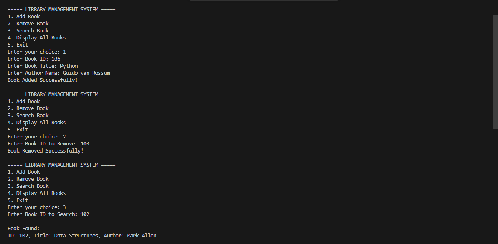
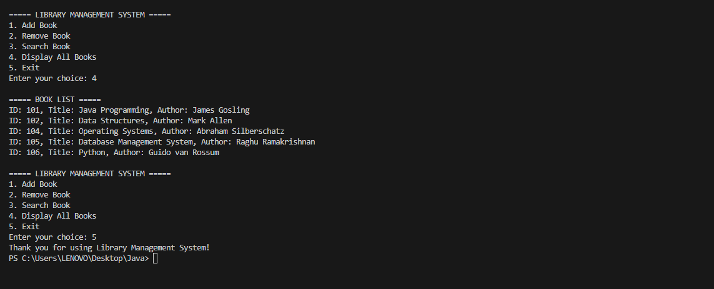

# 📚 Library Management System

A simple Java-based Library Management System developed using a Command-Line Interface (CLI). This project allows users to manage library books efficiently by performing operations such as adding, removing, searching, and displaying books.

## 🚀 Features

- Add new books to the library
- Remove books using Book ID
- Search books by ID or Title
- Display all available books
- User-friendly menu-driven interface
- Preloaded sample books for testing

## 🛠️ Technologies Used

- Java
- ArrayList
- Object-Oriented Programming (OOP)
- Scanner Class for User Input

## 📂 Project Structure

- `Book` Class
  - Stores book details such as ID, Title, and Author.
- `LibraryManagementSystem` Class
  - Handles all library operations and user interactions.

## 📖 Sample Books Included

| Book ID | Book Title | Author |
|----------|------------|---------|
| 101 | Java Programming | James Gosling |
| 102 | Data Structures | Mark Allen |
| 103 | Computer Networks | Andrew Tanenbaum |
| 104 | Operating Systems | Abraham Silberschatz |
| 105 | Database Management System | Raghu Ramakrishnan |

## ▶️ How to Run

1. Clone the repository:
   ```bash
   git clone https://github.com/your-username/LibraryManagementSystem.git
   ```

2. Open the project in VS Code or any Java IDE.

3. Compile the program:
   ```bash
   javac LibraryManagementSystem.java
   ```

4. Run the program:
   ```bash
   java LibraryManagementSystem
   ```

## 📸 Sample Output

```text
===== LIBRARY MANAGEMENT SYSTEM =====

1. Add Book
2. Remove Book
3. Search Book
4. Display All Books
5. Exit

Enter your choice:
```

## 🎯 Learning Outcomes

- Understanding Java Classes and Objects
- Working with ArrayList Collections
- Implementing CRUD Operations
- Handling User Input using Scanner
- Building Menu-Driven Applications

## Screenshots




## 👨‍💻 Author

**Swatishree Padhiary**

## 📜 License

This project is developed for educational and learning purposes.
